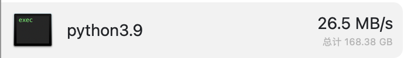

# Lighting-bilibili-download
⚡️快如闪电的 [bilibili](https://www.bilibili.com/) 视频下载工具，基于 Python 现代 Async 异步特性，高速批量下载整部动漫，电视剧，电影，up投稿...

<div align="center">  </div>

⚡️在200M宽带中实测可以拉满网速

<div align="center">  </div>

## 特性 Features
高性能，高并发，Asynchronous everywhere，得益于Python对于协程的支持，以及现代 Async HTTP 框架 [httpx](https://www.python-httpx.org/) ，和 [anyio](https://anyio.readthedocs.io/en/stable/) ：
* 单个媒体文件（音频/视频）的分段异步下载，以及备选服务器的同时利用
* 单个视频的音视频异步下载
* 多个视频的异步下载
* 断点续传
* 用户可控的并发量设置
* 与高并发配合的很好的进度条
* HTTP/2协议支持
* 异步文件I/O
* 异步视频合成进程

## 依赖环境 Environment
1. Python 相关依赖
```shell
pip install 'httpx[http2]' rich
```
2. [FFmpeg](https://ffmpeg.org/contact.html#MailingLists) ：一个命令行视频工具，用于合成下载的音频和视频

    * macOS 下可以通过`brew install ffmpeg`进行安装。
    * Windows 下载请至官网 https://ffmpeg.org/download.html#build-windows ，安装好后需要配置环境变量。
    * 最终确保在命令行中可以调用`ffmpeg`命令即可。

## 快速上手 Quick Start
### 批量下载
批量下载整部动漫，电视剧，电影，up投稿.....只需要把命令中的`url`替换成你要下载的系列中任意一个视频的网页链接。\
到 bilibili 上找一个来试试吧～，比如这个李宏毅老师的机器学习视频：[链接](https://www.bilibili.com/video/BV1JE411g7XF)
```shell
python bili_cmd.py get_series 'url'
```
会下载文件至当前目录的`videos`文件夹中，默认自动创建。

💡提示：在zsh终端中可能要用`''`将url包住，其他终端暂未测试。
* 目前支持的类型
  * 投稿视频
  * 番剧
  * 电视剧
  * 纪录片
  * 电影

`get_series`很强大，会自动识别系列视频并下载，如果该系列只有一个视频（比如单p投稿）也是可以正常下载的。

💡什么是一个系列：比如一个多p投稿的所有p，一部动漫的所有集。
### 单个下载
用户😨：我不想下载那么多，只想下载单个视频。没问题，试试这个，只需要提供那个视频的网页链接：
```shell
python bili_cmd.py get_video 'url'
```
## 进阶使用 Advance Guide
请使用`python bili_cmd.py -h`查看更多参数提示，视频画面质量选择，包括并发量控制，下载目录等。
### 你是大会员？🥸
请在`-cookie`参数中填写浏览器缓存的`SESSDATA`cookie，填写后可以下载需要大会员的视频。

## 声明

